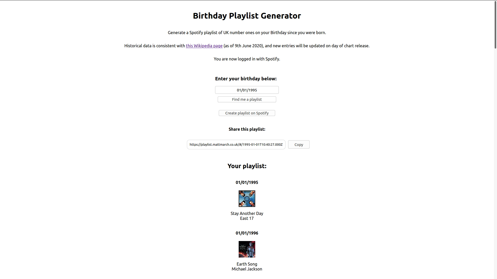

# Birthday Playlist Generator

This is an app to automatically generate a Spotify playlist of songs which have reached UK number one on your past Birthdays. There are 2 parts to this project:

### Web app

This is a React app which upon entering your Birthday will provide you with a playlist of UK number ones. You have the ability to authorize with Spotify to get more track information including cover art, and a button which will automatically turn the list into a Spotify playlist.

The chart data is queried from JSONBin (see the chart parser) and is filtered within the React application. Authorization with Spotify is via the Implicit Grant flow [as detailed here](https://developer.spotify.com/documentation/general/guides/authorization-guide/#implicit-grant-flow). The app can then use the access token received from Spotify to match up the tracks with tracks on Spotify (performing a separate search for each track), and displays the Spotify track name and album art in a list.

The app is deployed to Github pages, via a Github action ("Github pages deploy") which is triggered on pushing changes to master which affect the app directory.

### OfficialCharts Parser
This is a short Python script which can be run to scrape the latest chart info from [OfficialCharts](https://www.officialcharts.com/chart-news/all-the-number-1-singles__7931/). If run with a `-u` argument the data will be uploaded to [JSONBIN.io](https://jsonbin.io) to be used by the web app.

The parser is run by the "Run update data script" Github action.